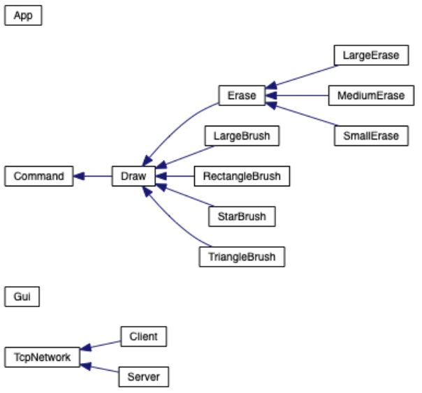

# Sketch Stitch: An Overview

**Sketch Stitch** is a collaborative painting application through which users can virtually paint on the same canvas over a network.

A 5-minute YouTube video listing features/technologies and demonstrating the application:

### Features
* Canvas
    * Paintbrushes (5 shapes / 3 eraser sizes)
    * Clear canvas with a color
    * 8 paint colors
    * Undo/redo functionality 
    * Keyboard Actions
* GUI for Color Palette and Brush Type
* Client-Server Network

### Technologies Used
* Written in C++
* Nuklear (GUI Library)
* SFML (Window, Graphics, Network)
* Catch2 (Unit Test Framework)
* OpenGL (Graphics Rendering)

### Developers
* Marielle Riveros
* Alexadriana Thammavongsa
* Clara Kim
* Fay Feghali

### Class Hierarchy

For detailed documentation on all classes, please download the files in ./docs/html and then open index.html.

*Due to the professor's request, I am unable to publically share the code for this project.*
